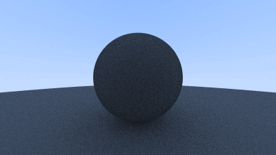

# raytracing_in_a_weekend
 No Maya. No Blender. No nothin', just pure vector math. Created out of curiosity towards 
 graphics programming using the book
 <a href="https://raytracing.github.io/books/RayTracingInOneWeekend.html">
    <cite>Ray Tracing in One Weekend</cite>
</a> by Peter Shirley, Trevor David Black and Steve Hollasch. Good book, would recommend.

<b>Progress</b>
 

